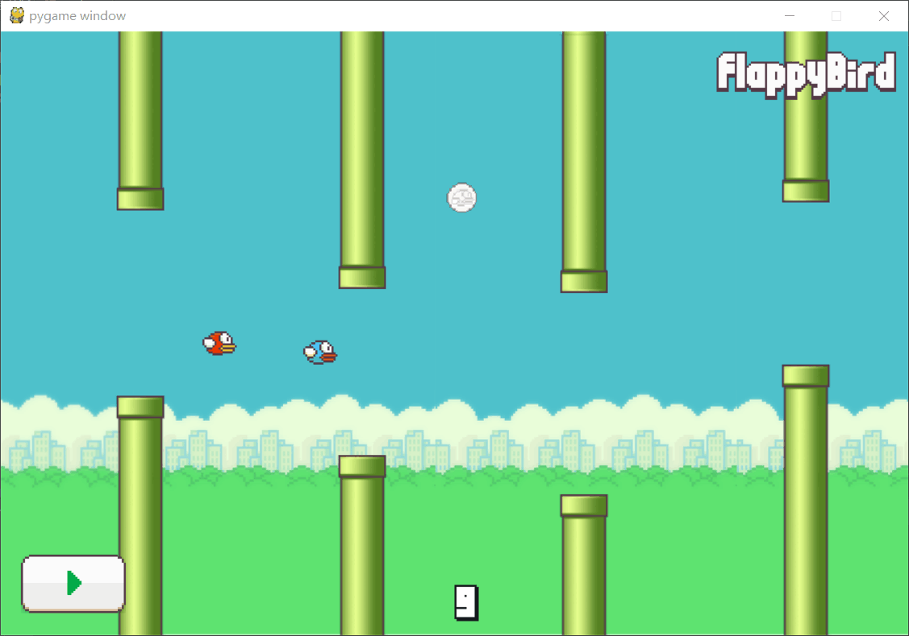
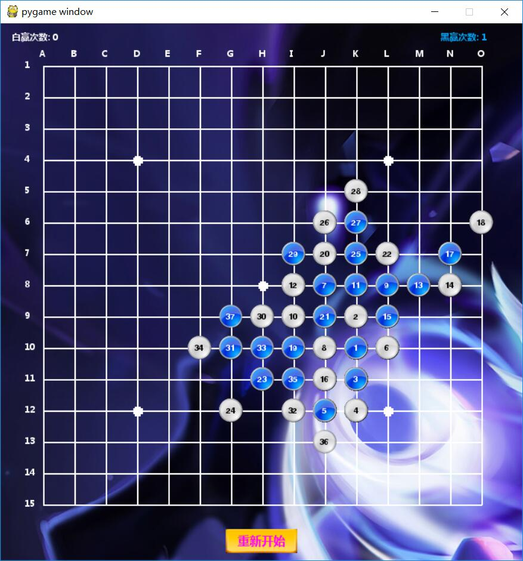

games
===

### 像素鸟

* 单/双人玩家（改成三/多人玩家玩法也不难）关卡制，其中玩家死亡，不影响其他玩家继续前行
* 管道会上下移动，移动速度随关卡提高而提升
* 游戏途中会随机产生金币，分金银两种，吃到不同金币增加相应分数
* 操作：键盘w/u控制玩家鸟上飞，空格键暂停/继续。

### 五子棋

* 玩家vs人机

### 打字母&&打方块

说明
-----
>* 若找不到可用Package，新建项目重新install pygame即可

